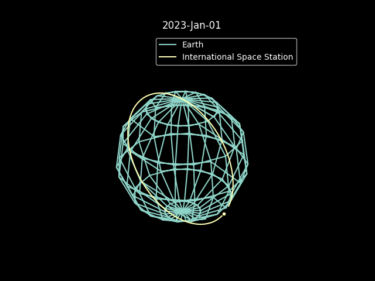
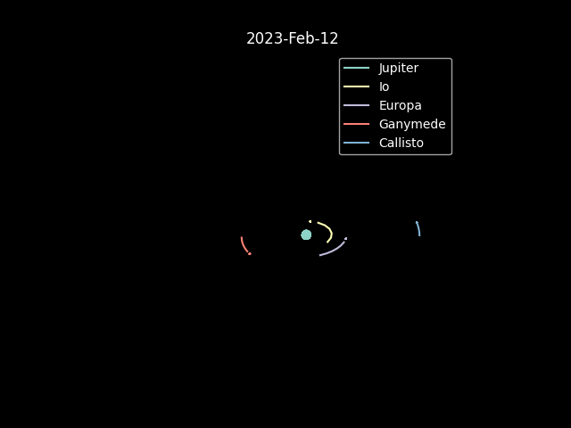
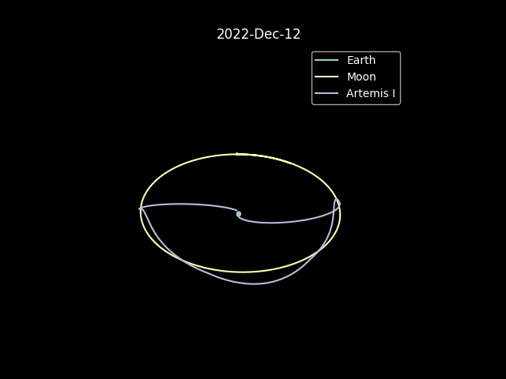

# OrbitViz

Visualize orbital data fetched directly from NASA's Horizons System. 

## How to use

1. Set parameters in `orbits.py` (or uncomment an existing scenario)

2. `$ python orbits.py`

## Parameters

* `objects` : a list of objects to track. Use the ids found [here](https://ssd.jpl.nasa.gov/horizons/time_spans.html) to create the list. Any bodies found in [this api](https://api.le-systeme-solaire.net/en/) will also be drawn to scale. 

* `center` : an object to use as the center of the scenario's frame of reference. There are some included as constants, but generally `'500@[object id]'` works.

* `start` and `stop` : the beginning and end of the scenario. The animation will loop.

* `frames` : how many frames are in the animation. Too few and orbits will look like stars, too many and Horizons will get mad (it doesn't allow timeslices smaller than 30s)

* `interval` : speed of the animation

* `history` : how long object trails should be, in terms of time. `None` means keep the whole trail from the start of the scenario.

Other things are tweakable, but not as relevant to a particular scenario. `res` represents the amount of points in the sphere drawings of large bodies.

## Nice to have features

* [ ] Instead of drawing spheres, I would really rather have it draw a filled circle.
* [ ] Export gif
* [ ] Color customization
* [ ] Supplement with other data
* [ ] Be able to make changes while an animation runs